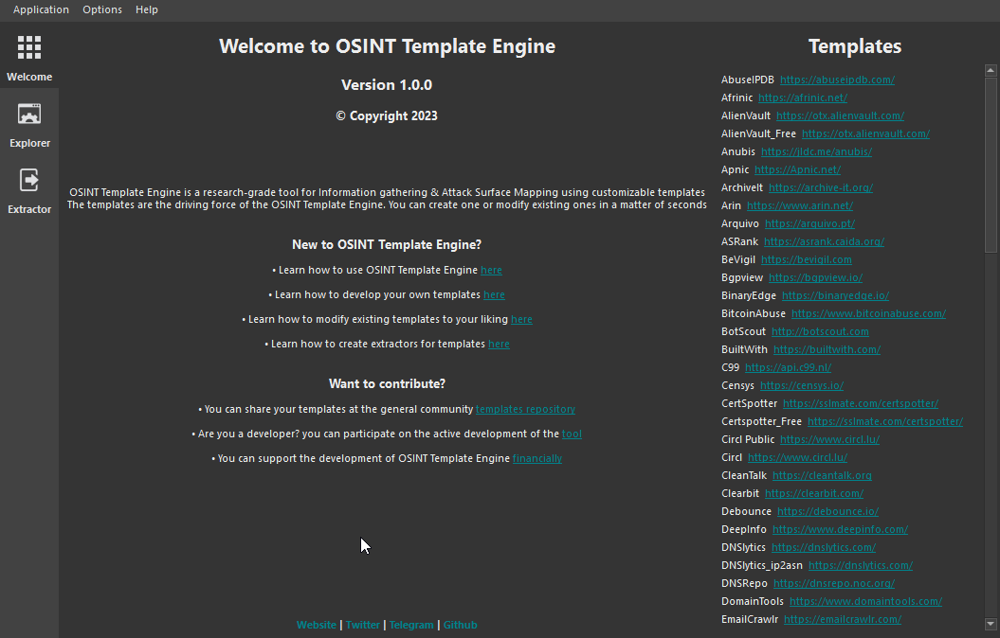

# Creating a Template for OSINT Template Engine.

OTE's Template are very easy to create. It only takes a few minutes to create a ready to use complex template for information gathering.

You can create the template manually by creating the json file with all the details or use the [OSINT Template Engine](https://github.com/3nock/OTE)'s template creator which is far more easy and faster.

For reference you can see the overall structure of the template [here](TEMPLATE_STRUCTURE.md).

## Steps

The following are the steps to take when creating a template.

### Identify an OSINT information Source.

The first step is to have an OSINT information source you want to create a template for. This sources are any online services and sites that provide OSINT data through API.

e.g.
- [shodan](https://shodan.io)
- [bgpview](https://bgpview.io/)
- [ripe](https://stat.ripe.net/)

_Note_: Currently OTE only supports API results in form of json or xml. More support will be added later on.

### Creating the template

- On OTE, goto `menu bar > options > New Template`.

- Enter the authors details (you details) i.e Your name and social contact or email.

- Enter the template's details i.e template name, link to its main site, link to its api documentation,summary description of the template.

- Then start adding API Endpoints and their details

### Creating an extractor

Learn how to create an extractor for an API Enpoint [here](WRITING_EXTRACTOR.md).
