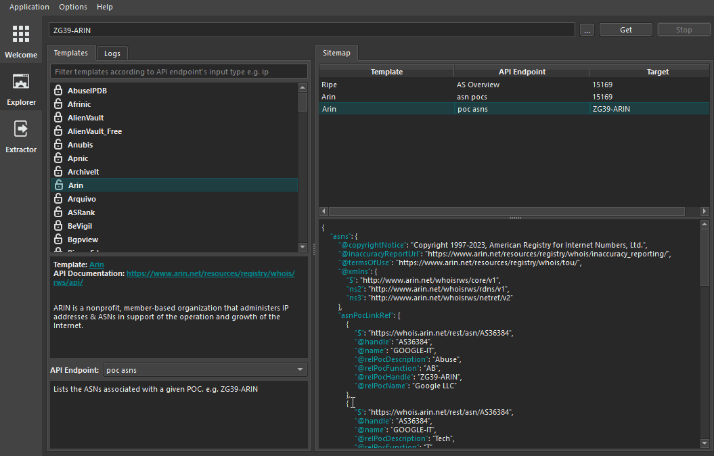
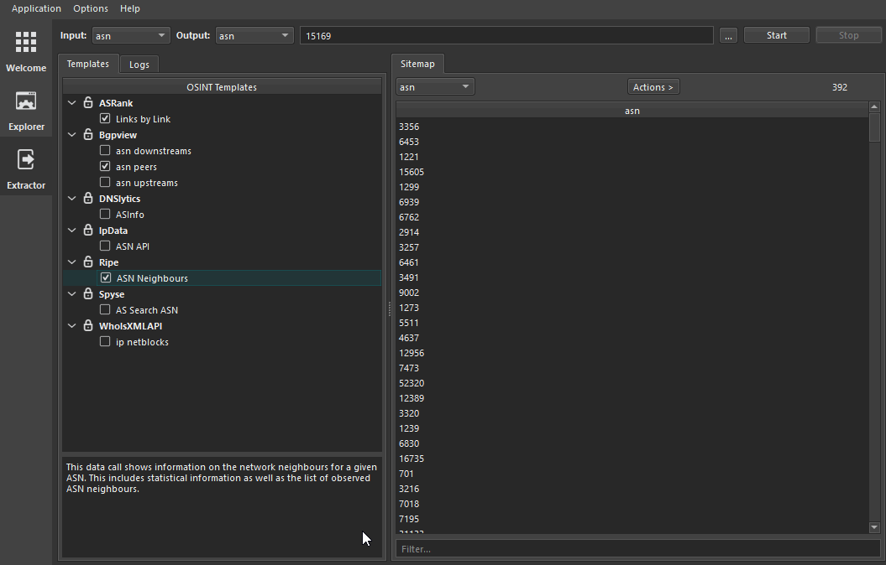
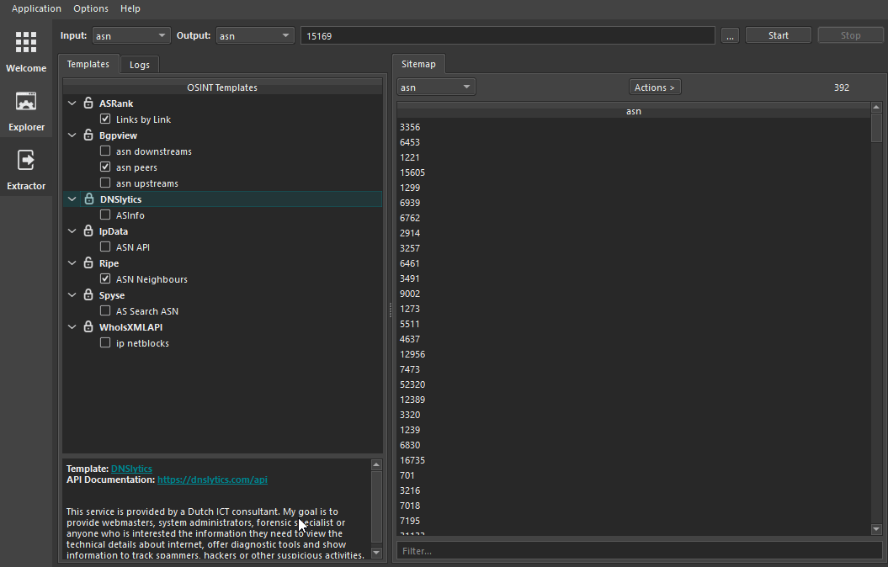

# Modifying a Template for OSINT Template Engine.
OTE's Template are very easy to modify. It only takes a few seconds to change the implemetation of the template.

For reference you can see the overall structure of the template [here](TEMPLATE_STRUCTURE.md).

## Steps

The following are the steps to take when modifying a template.

### Edit template from Explorer view

- On Explorer view's template tab right click on the template and edit.

### Edit template from Extractor view

- On Extractor view's template tab right click on the template then `Edit Template`.

### Edit Endpoint from Extractor view

- On Extractor view's template tab right click on the template's endpoint then `Edit Endpoint`.

