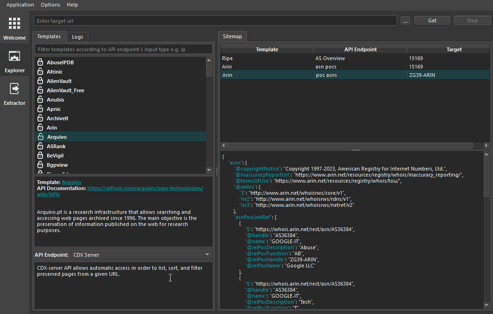

# How to create OSINT Template Engine's Extractor
OTE uses two types of extractors 
- [JSON Extractor](#json-extractor) - Extracts data from JSON API response.
- [XML Extractor](#xml-extractor) - Extracts data from XML API response.

To create an extractor choose the template for edit, go to endpoint you want to create an extractor for then add template name and script.

- Creating From Explorer view
<center></center>

_**NOTE 1: Extractors name should be the name of the data type that you are extracting**_

e.g. 

If you are extracting ip addresses from the Template's API response the extractor name should be `ip`, 

If it extracts domains the name should be `domain`.

If it extracts subdomains the name should be `subdomain`.

_**NOTE 2: Each Extractor should only extract one type of data**_

i.e 

An extractor shouldn't extract two types of data at the same time. e.g. extracting `asn` and `cidr` using the same extractor isn't allowed, instead create two different extractors; one extracting `asn` and another extracting `cidr`.

_**NOTE 3: A single API Endpoint shouldn't have two or more extractors with the same name**_

i.e

If the API endpoint has the data you want to extract at multiple different places in the API result, then design the extractor so that you can extract all areas simulteneously.

Each data type you want to extract from the same API endpoint should have only one extractor script with the name of the data type you want to extract.

## Json Extractor

The JSON Extractor extracts specific data from JSON API response.

The format struture of the extractor is the same as the format struture of the API response. With a difference that the extractor script contains some special indicators used for parsing and extracting data.

### **Special indicators  `$$`**

Used for extracting specific data.

depending on location, it can be used to extract different types of json data.

 - `$$object_name$$` - Used to extract the value of the 
 json object.
 
 e.g.
 
 For json API result
 ```json
 {
    "ip":"1.1.1.1"
 }
 ```

 Extractor Script
 ```json
 {
     "$$ip$$":""
 }
 ```
 _**It will extract the ip address value i.e `1.1.1.1`.**_
 
 - `"$$"` - Used to extract the name of the json object.

 e.g.

 For API result
 ```json
 {
     "query":"google.com",
     "data":{
         "google.cn":{
             "ip":"1.1.1.1"
         },
         "google.zh":{
             "ip":"2.2.2.2"
         },
         "google.ac":{
             "ip":"3.3.3.3"
         },
         "google.net":{
             "ip:":"4.4.4.4"
         }
     }
 }
 ```
 
 Extractor Script
 ```json
 {
    "data":{
        "$$":{}
    }
 }
 ```
 _**It will extract the domain names i.e `google.cn, google.zh, google.ac, google.net`.**_

 - `["$$"]` - Used to extract whatever data type is inside the json array.

 e.g.

 For API result
 ```json
 {
     "query":"google.com",
     "data":[
         "google.cn",
         "google.zh",
         "google.ac",
         "google.net"
     ]
 }
 ```
 
 Extractor Script
 ```json
 {
    "data":["$$"]
 }
 ```
 _**It will extract all the strings inside the `data` json array i.e `google.cn, google.zh, google.ac, google.net`.**_

 For API result
 ```json
 {
     "query":"google.com",
     "data":[
         {
             "ip":"1.1.1.1"
         },
         {
             "ip":"2.2.2.2"
         },
         {
             "ip":"3.3.3.3"
         },
         {
             "ip:":"4.4.4.4"
         }
     ]
 }
 ```
 
 Extractor Script
 ```json
 {
    "data":{
        "data":["$$"]
    }
 }
 ```
 _**It will extract all the json objects inside the `data` json array i.e `{"ip":"1.1.1.1"}, {"ip":"2.2.2.2"}, {"ip":"3.3.3.3"}, {"ip:":"4.4.4.4"}`.**_

### **Special indicators `*`**

Used as a wildcard for json object's key names.

For json results with objects with different names, you can use the `*` indicator to iterate over all objects key names.

e.g. 

For API result
```json
{
    "query":"google.com",
    "data":{
        "google.cn":{
            "ip":"1.1.1.1"
        },
        "google.zh":{
            "ip":"2.2.2.2"
        },
        "google.ac":{
            "ip":"3.3.3.3"
        },
        "google.net":{
            "ip:":"4.4.4.4"
        }
    }
}
```

Extractor Script
```json
{
    "data":{
        "*":{
            "$$ip$$":""
        }
    }
}
```
_**It will parse through all objects inside the `data` json object and and extract their ip addresses ie. `"1.1.1.1", "2.2.2.2", "3.3.3.3", "4.4.4.4"`.**_

## Xml Extractor

The XML Extractor extracts specific data from XML API response.

The format struture of the extractor is the same as the format struture of the API response. With a difference that the extractor script contains some special indicators used for parsing and extracting data.

### **Special indicators  `$$`**

Used for extracting specific data.

depending on location, it can be used to extract different types of xml data.

e.g. 

For XML result
```xml
<result>
    <data>
        <ip>1.1.1.1</ip>
        <ip>2.2.2.2</ip>
        <ip>3.3.3.3</ip>
        <ip>4.4.4.4</ip>
        <ip>5.5.5.5</ip>
    </data>
</result> 
```
Extractor script
```xml
<result>
    <data>
        <ip>$$</ip>
    <data>
<result>
```
_**It will extract the `ip` values i.e `1.1.1.1, 2.2.2.2, 3.3.3.3, 4.4.4.4, 5.5.5.5`**_

Extractor script
```xml
<result>
    <data>$$<data>
<result>
```
_**It will extract the `data`'s xml elements values i.e. `<ip>1.1.1.1</ip>, <ip>2.2.2.2</ip>, <ip>3.3.3.3</ip>, <ip>4.4.4.4</ip>, <ip>5.5.5.5</ip>`**_
